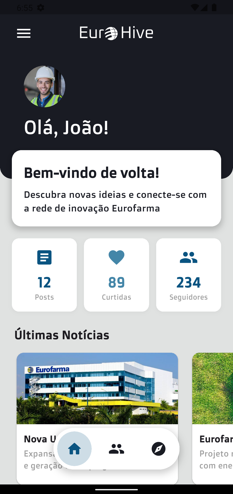
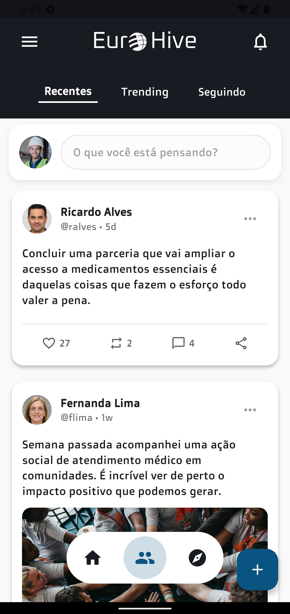
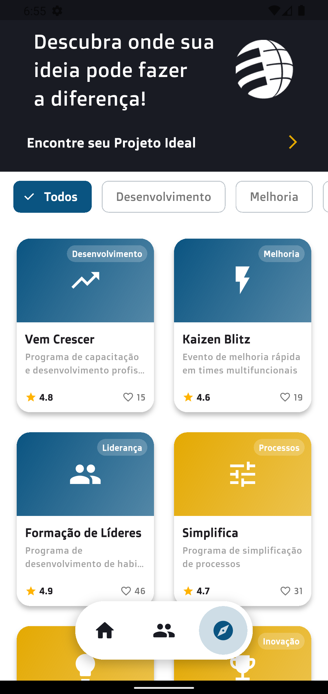

# EuroHive

Uma plataforma social para colaboradores eurofarma compartilharem ideias, projetos e se conectarem.

## 🚀 Funcionalidades

### Tela de Login

### Home Screen

### Feed Screen (Tipo Twitter)

### Discovery Screen

### Navegação

- ## 📸 Screenshots do App

<p align="center">
  
  
   
</p>

## ▶️ Demonstração do App

🎥 **Vídeo no YouTube mostrando o app em funcionamento:**  
👉 [Demonstração do App](https://youtu.be/5tJ5LR6r554?si=2aNaqV_5N6Ph_1ux)

---

## 🛠️ Tecnologias Utilizadas

- **Flutter** 3.32.8
- **Dart** 3.8.1
- **Material Design** 3
- **Google Fonts**
- **Flutter Lints** para qualidade de código

## 📱 Estrutura do Projeto

```
lib/
├── core/
│   ├── constants/
│   │   ├── app_assets.dart
│   │   ├── app_colors.dart
│   │   └── app_texts.dart
│   └── theme/
│       └── app_theme.dart
├── screens/
│   ├── login_screen.dart
│   ├── home_screen.dart
│   ├── feed_screen.dart
│   ├── discovery_screen.dart
│   └── main_screen.dart
├── routes/
│   └── app_routes.dart
└── main.dart
```

## 🚀 Como Executar

1. **Clone o repositório**
   ```bash
   git clone [url-do-repositorio]
   cd eurohive
   ```

2. **Instale as dependências**
   ```bash
   flutter pub get
   ```

3. **Execute o projeto**
   ```bash
   flutter run
   ```

## 📋 Pré-requisitos

- Flutter SDK 3.32.8 ou superior
- Dart 3.8.1 ou superior
- Android Studio / VS Code
- Emulador Android ou dispositivo físico

## 🔧 Configuração

O projeto está configurado para:
- **Android**: API 21+
- **iOS**: iOS 11.0+
- **Web**: Suporte completo
- **Desktop**: Windows, macOS, Linux

## 📱 Telas Implementadas

### 1. Login Screen (`/login`)
- Tela inicial do app
- Design glassmorphism
- Validação de campos
- Navegação para Home após login

### 2. Main Screen (`/main`)
- Container principal com navegação inferior
- Gerencia as 3 telas principais
- Estado persistente das telas

### 3. Home Screen
- Dashboard principal
- Menu lateral (Drawer)
- Cards de estatísticas
- Seção de notícias
- Lista de projetos recentes

### 4. Feed Screen
- Timeline de posts
- Criação de novos posts
- Interações sociais
- Interface similar ao Twitter

### 5. Discovery Screen
- Explorar projetos
- Filtros por categoria
- Cards visuais de projetos
- Sistema de aplicação

## 📄 Licença

Este projeto está sob a licença MIT. Veja o arquivo `LICENSE` para mais detalhes.

## 👨‍💻 Autor

**EuroHive Team**
- Desenvolvido com ❤️ para a comunidade de colaboradores Eurofarma

---

**EuroHive** - Conectando pessoas, compartilhando ideias, construindo o futuro! 🚀
